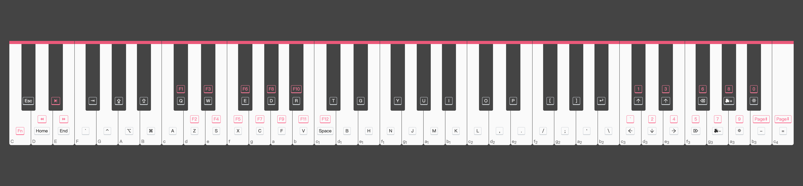

<h1 align="center">🎹 MIDK </h1>

<p align="center">
  <a href="https://travis-ci.org/zthxxx/midk" target="_blank" rel="noopener noreferrer"></a>
  <a href="https://www.npmjs.com/package/midk" target="_blank" rel="noopener noreferrer"></a>
  <a href="https://www.npmjs.com/package/midk" target="_blank" rel="noopener noreferrer"></a>
  <a href="https://nodejs.org/" target="_blank" rel="noopener noreferrer"></a>
  <a href="https://github.com/zthxxx/midk/blob/master/LICENSE" target="_blank" rel="noopener noreferrer"></a>
</p>


Mapping MIDI keypress to PC keyboard, that you can work or code with your MIDI kerboard 🎉

(e.g. this project is code in midk)




## Install & Usage

```bash
npm i -g midk

midk
```

## Dev & Debugg

launch midk portal and watching files change

```bash
npm start
```

visual the keys-mapping like the above preview image 

```bash
npm run cheatsheet
```

## Customization

you can customize keys-mapping in config file `~/.midk/portal.yml` (created after install).

the default config is stored in [`src/portal.ts`](./src/portal.ts)

```yaml
# Helmholtz pitch notation is used for note names
# all supported note names are written in `midi.ts`
# https://github.com/zthxxx/midk/blob/master/src/midi.ts

# if enable playMode, stop to control keyboard
playMode:
  # default enable when start
  enable: false
  # composite keys to toggle enable/disable playMode
  toggle:
    - CSharp
    - DSharp
    - aSharp2

# all supported key names are written in `keyboard.ts`
# https://github.com/zthxxx/midk/blob/master/src/keyboard.ts
#
# interface Portal {
#   [NoteName]: KeyName
# }
portal:
  CSharp: escape
  FSharp: tab
  G: control
  GSharp: capsLock
  A: alt
  ASharp: shift
  B: command

  c: a
  cSharp: q
  d: z
  dSharp: w
  e: s
  f: x

  ...

# when press the Fn-key, alter some keys mapping
#
# interface FnPortal {
#   [NoteName]: Portal
# }
fnPortal:
  C:
    cSharp: f1
    d: f2
    dSharp: f3
    e: f4
    f: f5

    ...
```

## License

[MIT LICENSE](./LICENSE)


## Author

**midk** © [zthxxx](https://github.com/zthxxx), Released under the **[MIT](./LICENSE)** License.<br>

> Blog [@zthxxx](https://blog.zthxxx.me) · GitHub [@zthxxx](https://github.com/zthxxx)
